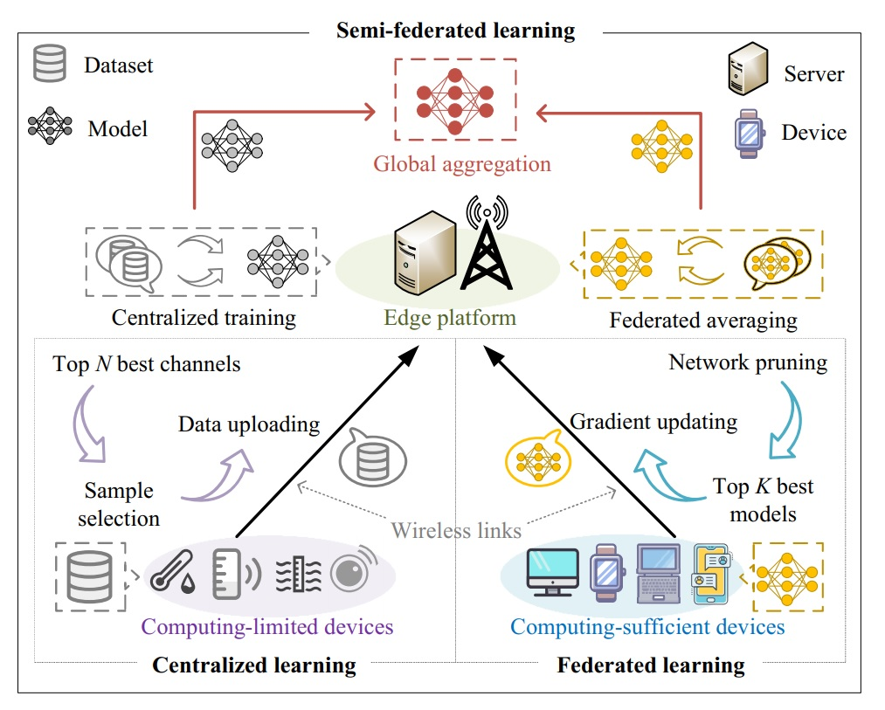
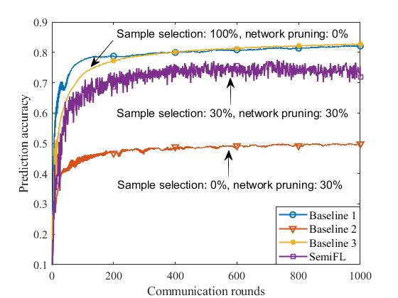
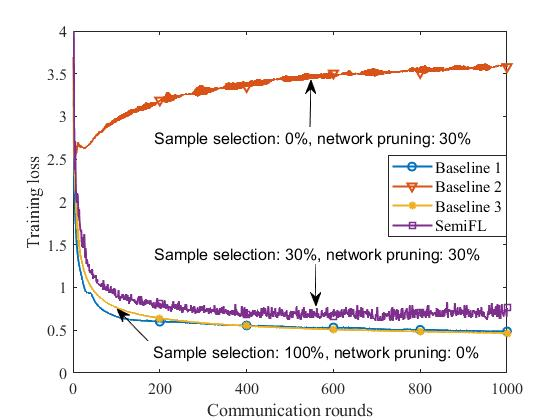
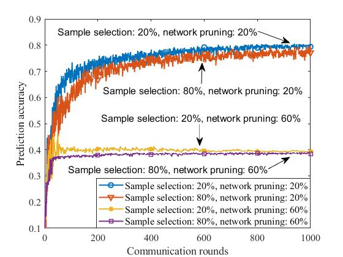
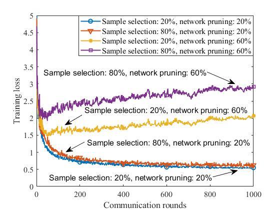
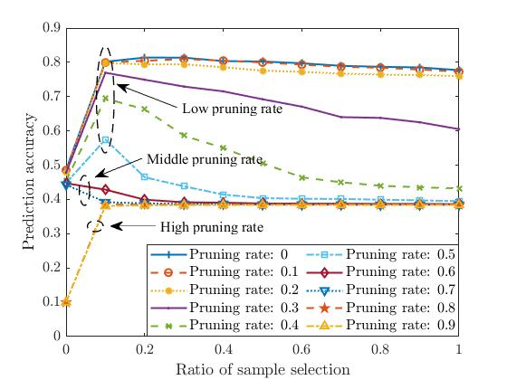
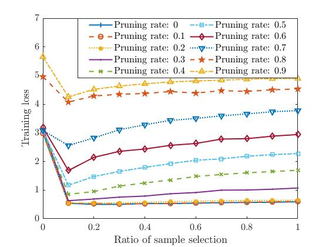

## Semi-Federated Learning for Collaborative Intelligence in Massive IoT Networks

**Note:** All code and data are used for the following ACM SIGCOMM 2022 poster paper:
> **Title:** Semi-Federated Learning for Collaborative Intelligence in Massive IoT Networks
>
> **Author:** Wanli Ni, Jingheng Zheng, and Hui Tian
>
> **Institution:**  Beijing University of Posts and Telecommunications

In this paper, we propose a novel semi-federated learning (SemiFL) concept that seamlessly integrates the conventional centralized learning and federated learning into a harmonized framework.

### Citation

```
@inproceedings{Ni2022Semi,
    author = {Ni, Wanli and Zheng, Jingheng and Tian, Hui},
    title = {Semi-Federated Learning for Collaborative Intelligence in Massive IoT Networks},
    booktitle = {SIGCOMM'21 Poster and Demo Sessions (SIGCOMM21 Demos and Posters)},
    year = {2022},
    month = {August},
    note = {under review}
}
```

### 1. Proposed SemiFL Framework



### 2. Experimental Results and Discussions

**1. Parameter Settings**

| Parameters | Description                          | Value |
| ---------- | ------------------------------------ | ----- |
| Neural network | An MLP with three hidden layers | [784 50 100 50 10] |
| Dataset        | Fashion-MNIST  | 10 categories (6,000 each) |
| Distribution   | Non-independent and identically distributed (non-IID) data | Each device has one type of samples |
| `N`        | Number of computing-limited devices | 4     |
| `K`        | Number of computing-sufficient devices | 6     |
| `S` 		 | Sample selection | [0, 1] |
| `P` 		 | Network pruning  | [0, 1) |
| `T` 		 | Number of communication rounds | 1,000 |
| $\eta$ 	 | Learning rate    | 0.1 |

**2. Benchmarks**

| Names        | Description                   | File               |
| ------------ | ----------------------------- | ------------------ |
| `Baseline 1` | Centralized learning (CL)     | `centralized_learning.m`      |
| `Baseline 2` | Federated learning (FL)       | `federated_learning.m` |
| `Baseline 3` | SemiFL with $S=0$ and $P=0$ | `semi_federated_learning_ideal.m` |

**3. Simulation Results (The First Group)**





**Discussion #1 (Learning performance versus the number of communication rounds):** In the experiments, we demonstrate the learning performance achieved by the proposed SemiFL framework and different benchmarks under the non-IID setting. From the figures in the first group of simulation results, the following two key observations can be drawn. 

- The proposed SemiFL framework without sample selection and network pruning (i.e., Baseline 3) outperforms FL (i.e., Baseline 2), and achieves the similar performance to CL (i.e., Baseline 1) which has higher communication overhead due to the transmission of the entire dataset. 
- Although sample selection and network pruning can further reduce the communication overhead of SemiFL, they also degrade the achievable learning performance in terms of prediction accuracy and training loss.

**4. Simulation Results (The Second Group)**





**Discussion #2 (Learning performance versus the number of communication rounds under different settings of sample selection and network pruning):** From the figures in the second group of simulation results, we observe the following two phenomena.

- One the one hand, when the sample selection ratio of these computing-limited devices is fixed, increasing the network pruning rate will deteriorate the learning performance in terms of prediction accuracy and training loss. This is because networking pruning degrades the learning ability of these computing-limited devices, but has the benefits of reducing communication overhead and saving local computation time. 
- On the other hand, when the network pruning rate is fixed, lowering sample selection ratio is beneficial to improve the learning performance under the non-IID data settings. This is different from what we observed in the IID cases considered by our previous papers [4, 6, 10]. Therefore, in the following, we conduct more experiments to show the achievable learning performance under finer settings of sample selection and network pruning.

**5. Simulation Results (The Third Group)**





**Discussion #3 (Learning performance under different sample selection and network pruning ratios):** From the third group of simulation results, we observe the following three key insights when varying the values of sample selection and network pruning.

- When the network pruning rate is low (e.g., $0 \le P < 0.6$), it can be seen that the prediction accuracy first increases with the sample selection ratio, and then decreases with it after the sample selection ratio is greater than 0.1. This is mainly because when the pruning rate is low, the learning ability of the used multi-layer perceptron (MLP) has not been fully developed, so uploading some raw data for centralized learning can help it further improve the prediction accuracy. However, due to the non-IID setting, the gradient descent directions of CL and FL are inconsistent, so uploading more raw data will make the performance worse. That is to say, in the considered non-IID case, it is not that the more raw data devices upload, the better the model performance will be, but there is an optimal sample selection ratio.
- When the network pruning rate is middle (e.g., $0.6 \le P < 0.8$), the learning ability of the MLP is insufficient to complete the multi-category classification task. Therefore, the prediction accuracy decreases with the ratio of sample selection. It should be clarified that the higher the sample selection ratio, the more raw data will be uploaded. A popular explanation for this is not to give a dumb kid too hard homework.

- When the network pruning rate is high (e.g., $0.8 \le P < 1$), the learning ability of the MLP is ignorable. Therefore, the total learning performance just depends on the CL part, and its performance reaches the optimal level at the sample selection ratio of 0.1. 

### 3. Directory Structure

```
code/
	├── Fashion_MNIST/
		├── dataset pre-processing tools/
		├── non_iid_labels.mat
		├── non_iid_samples.mat
		├── test_data_all.mat
		├── test_label_all.mat
		├── train_data_all.mat
		├── train_label_all.mat
	├── centralized_learning.m
	├── federated_learning.m
	├── semi_federated_learning_ideal.m
	├── semi_federated_learning.m
	├── get_selected_CL_devices.m
	├── get_selected_FL_devices.m
	├── get_locations.m
	├── get_channels.m
	├── get_gradient.m
	├── get_pruned_model.m
	├── get_initial_model.mat
	└── performance_vs_rounds/
data/
	├── CL_without_sampling.mat
	├── FL_with_pruning.mat
	├── SemiFL_without_sampling_and_pruning.mat
	├── SemiFL_with_sampling_and_pruning.mat
	├── draw_accuracy.m
	└── draw_loss.m	
```

> **Note:** The code in this repository is primarily used to generate the simulation results in the first group. The results in the second and third groups can be easily obtained by changing the value settings for sample selection and network pruning.

### 4. References

1. M. M. Amiri, D. Gündüz, S. R. Kulkarni and H. V. Poor, "Convergence of Update Aware Device Scheduling for Federated Learning at the Wireless Edge," in IEEE Transactions on Wireless Communications, vol. 20, no. 6, pp. 3643-3658, June 2021.

2. A. M. Elbir, S. Coleri and K. V. Mishra, "Hybrid Federated and Centralized Learning," 2021 29th European Signal Processing Conference (EUSIPCO), 2021, pp. 1541-1545.

3. A. Li, L. Zhang, J. Tan, Y. Qin, J. Wang and X. -Y. Li, "Sample-level Data Selection for Federated Learning," IEEE INFOCOM 2021 - IEEE Conference on Computer Communications, 2021, pp. 1-10.

4. W. Ni, Y. Liu, H. Tian, Y. C. Eldar, and K. Huang, "SemiFL: Semi-Federated Learning Empowered by Simultaneously Transmitting and Reflecting Reconfigurable Intelligent Surface," ICC 2022 - 2022 IEEE International Conference on Communications (ICC), Seoul, South Korea, 2022, pp. 1-6.

5. W. Ni, Y. Liu, Z. Yang and H. Tian, "Over-the-Air Federated Learning and Non-Orthogonal Multiple Access Unified by Reconfigurable Intelligent Surface," IEEE INFOCOM 2021 - IEEE Conference on Computer Communications Workshops (INFOCOM WKSHPS), 2021, pp. 1-6.

6. W. Ni, Y. Liu, Z. Yang, H. Tian and X. Shen, "Federated Learning in Multi-RIS Aided Systems," in IEEE Internet of Things Journal, doi: 10.1109/JIOT.2021.3130444.

7. J. Ren, W. Ni and H. Tian, "Towards Communication-Learning Trade-off for Federated Learning at the Network Edge," in IEEE Communications Letters, doi: 10.1109/LCOMM.2022.3174295.

8. K. Yang, Y. Shi, Y. Zhou, Z. Yang, L. Fu and W. Chen, "Federated Machine Learning for Intelligent IoT via Reconfigurable Intelligent Surface," in IEEE Network, vol. 34, no. 5, pp. 16-22, September/October 2020.

9. N. Yoshida, T. Nishio, M. Morikura, K. Yamamoto and R. Yonetani, "Hybrid-FL for Wireless Networks: Cooperative Learning Mechanism Using Non-IID Data," ICC 2020 - 2020 IEEE International Conference on Communications (ICC), Dublin, Ireland, 2020, pp. 1-7.

10. J. Zheng, W. Ni, H. Tian, D. Gunduz, and T. Q. S. Quek, "Semi-Federated Learning: An Integrated Framework for Pervasive Intelligence in 6G Networks," IEEE INFOCOM 2022 - IEEE Conference on Computer Communications Workshops (INFOCOM WKSHPS), 2022, pp. 1-6.
